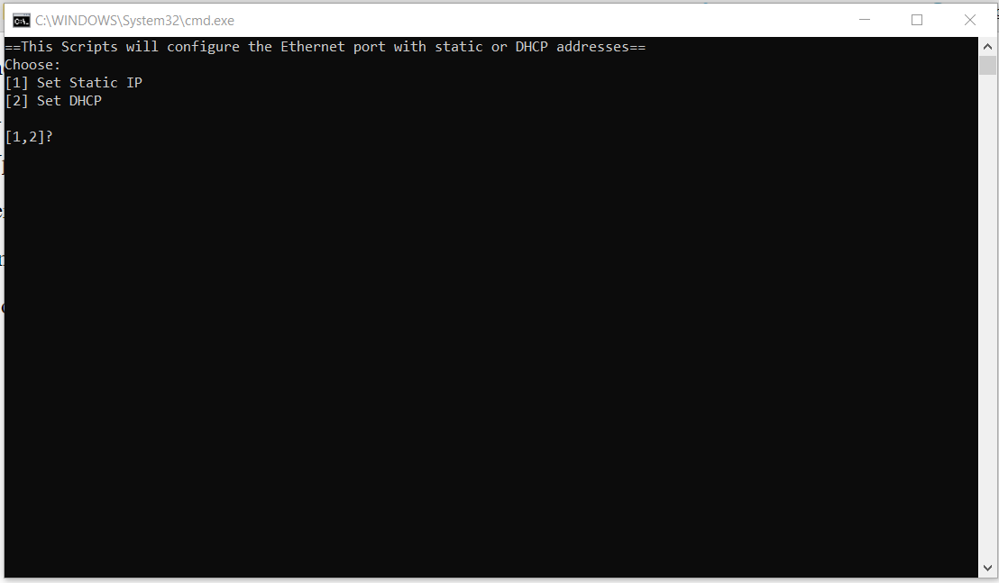

# Project 1

## This batch script will either assign a set of static IP addresses to the Ethernet NIC card or enable DHCP.

The concept is that I have routers and switches that use GUIs for configuration, and every time I need to configure one of them, I have to set the appropriate IP on my NIC card. In only two clicks, this script will automate that process.

These are IPs use for this script: 
- 192.168.0.51 255.255.255.0
- 192.168.1.100 255.255.255.0
- 192.168.15.10 255.255.255.0
- 192.168.2.51 255.255.255.0
- 192.168.88.51 255.255.255.0


From the batch file directory, run the program as administrator (you can only run and execute this script as an administrator).

```bash
PS C:\it3038c-scripts\Project1> powershell -command "Start-Process staticdhcp.bat -Verb runas" 
```
A new cmd administrator window will be opened when you run the command above. Click yes to open.


The script will prompt you to select 1 for static or 2 for DHCP.
Example Output: 
```bash
==This Scripts will configure Ethernet port on static or DHCP==
Choose:
[1] Set Static IP
[2] Set DHCP

[1,2]? 1
"Setting static IPs on the Ethernet port..."


Completed
Press any key to continue . . .

```
In this example we selected 1 to set static IP on the Ethernet port, once completed the script will prompt you to press any key to exit.

You can verify the result on your Ethernet port: Control Panel\Network and Internet\Network Connections


If there is a duplicate IP or if you run option 1 again, you will get this out put:
```bash
[1,2]? 1
"Setting static IPs on the Ethernet port..."

The object is already in the list.

The object is already in the list.

Completed
Press any key to continue . . .
```
"The object is already in the list." Tells you that the static IPs you trying to add is/are already set on the NIC card.

Now, let switch the Ethernet port back to DHCP. Run the script as administrator and type 2 when prompted.
```bash
PS C:\it3038c-scripts\Project1> powershell -command "Start-Process staticdhcp.bat -Verb runas" 
```
Example output: 

```bash
==This Scripts will configure static or DHCP addreses on the Ethernet port==
Choose:
[1] Set Static IP
[2] Set DHCP

[1,2]? 2
Resetting IP Address and Subnet Mask For DHCP

Completed
Press any key to continue . . .

```
Type any key to exit the script. You can verify the result on your Ethernet port: Control Panel\Network and Internet\Network Connections


If you run it again with option 2 you will get "DHCP is already enabled on this interface". 

Example output:

```bash
==This Scripts will configure static or DHCP addreses on the Ethernet port==
Choose:
[1] Set Static IP
[2] Set DHCP

[1,2]? 2
Resetting IP Address and Subnet Mask For DHCP
DHCP is already enabled on this interface.

Completed
Press any key to continue . . .
```


