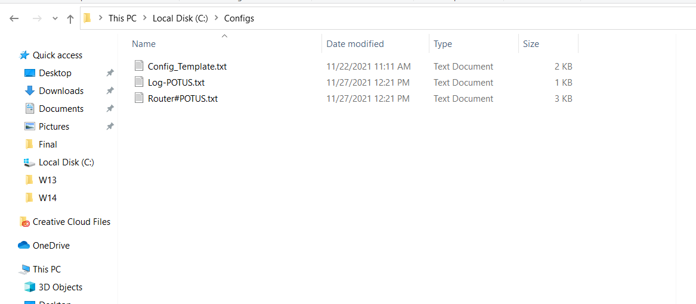

# Project 3

## This Powershell script will generate a cisco router configuration file using a template and export that configuration file to a directory.

First we need a configuration template file that the script will use to pull configuration from and insert the user input to create a configuration file for the router.
In your C:\ drive, create a new folder(dir) called  Configs, in Configs folder create a new text file called Config_Template.txt. Click here [Config_Template](/Project3/ConfigTemplate.md) to open the template file then Copy and save the output in Config_Template.txt file you created in C:\Configs. 

From the ConfigGen.ps1 file directory, type one of these commands to run the script:
```bash
PS C:\it3038c-scripts\Project3> powershell .\ConfigGen.ps1 
```
or
```bash
PS C:\it3038c-scripts\Project3>.\ConfigGen.ps1 
```
The script will prompt you to input a set of data. Hit enter after each entry to validate your input.
These will include: Router model, hostaname, WAN IPs, LAN IP and Subnet mask.

Example output:
```bash
PS C:\it3038c-scripts\Project3> .\ConfigGen.ps1
Enter router model (4300, 4400)
4300
Enter number of LAN IPs (1, 2)
1
enter site name (XXXXX)
POTUS
enter WAN host IP
10.1.1.2
enter WAN Gateway
10.1.1.1
enter WAN Subnet Mask
255.0.0.0
valid subnet mask
enter LAN IP 1
10.2.2.0
enter LAN Subnet 1
255.255.255.0
valid subnet mask
Hit Enter to create Router#POTUS.txt
```
After entering all the info the script will prompt you to hit enter to create the configuration file named with the hostname you provided.
If everything was correctly entered you will get the bellow message showing you where to locate the configuration file generated.
```bash
Completed! Router#POTUS.txt can be found in C:\Configs
PS C:\it3038c-scripts\Project3>
```
You can open C:\Configs to verify that the config file is in there and that it(Router#POTUS.txt) has all the info you entered.

Example output:


```bash
hostname ihg-POTUS
!
!
username installer privilege 15 secret P@ssw0rd!
enable password P@ssw0rd!
!  
!  
ip ssh time-out 60
crypto key generate rsa general-keys modulus 2048
!
!
bsd-client server url https://cloudsso.cisco.com/as/token.oauth2
clock timezone PST -5
clock summer-time EDT recurring
!
ip dhcp excluded-address 10.2.2.1 10.2.2.7
!
ip dhcp pool LAN1
 network 10.2.2.0 255.255.255.0
 default-router 10.2.2.1
 dns-server 75.75.75.75 75.75.76.76
 
ip dhcp pool LAN2Range
 network  
 default-router 
 dns-server 75.75.75.75 75.75.76.76
!
!
interface GigabitEthernet0/0/0
 description WAN 
 ip address 10.1.1.2 255.0.0.0 
 no cdp enable
 no shut
!
interface GigabitEthernet0/0/1
description LAN
 ip address 10.2.2.1 255.255.255.0
 ip address   secondary 
 no cdp enable
 no shut
!
!
ip route 0.0.0.0 0.0.0.0 10.1.1.1
!
!
ip access-list extended COPP
 deny ip 10.2.2.0 0.0.0.255 any 
 permit udp any any eq ntp
 permit ip any any
!
banner login ^
********************************************************************
Warning!
Authorized personnel only. Please log out immediately if you are not 
an authorized administrator
 
******************************************************************** 
Router  : $(hostname) 
Location: $(line-desc) 
^
!
ip ssh version 2 
ip ssh authentication-retries 3
line con 0
 logging synchronous
line vty 0 15
 exec-timeout 10 0
 transport input ssh
!
wr
```
# Well done, you have created a router config file. Hope you enjoyed it.


