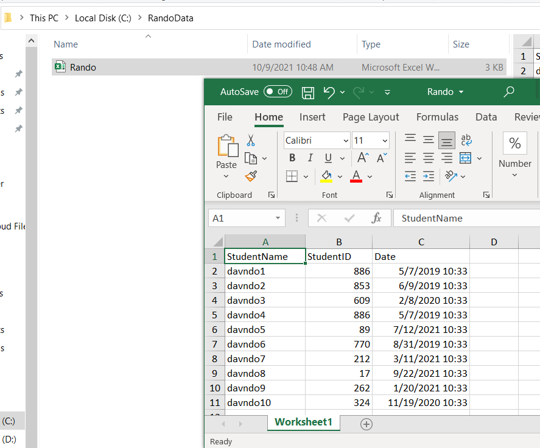
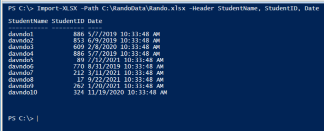
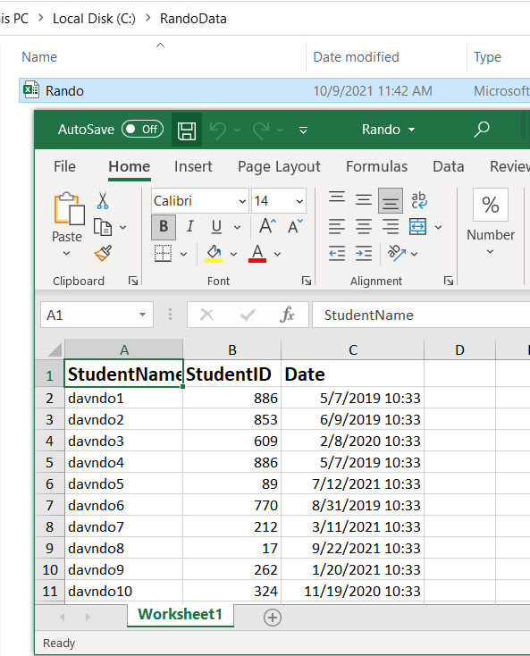

# PSExcel
The PSExcel module provides a simple tool for dealing with Excel and does not rely on Excel or its COM interface to function.

## Functionality
PSExcel module can be used to accomplish the following tasks:
•	Export random PowerShell output to Excel spreadsheets
•	Import Excel spreadsheets to PowerShell as objects
•	Format excel spreadsheets

## Useful Commands
• If you have PowerShell 5, or the PowerShellGet module run this command as administrator to install PSExcel module:
```bash
Install-Module PSExcel
```
• To import the module run:
```bash
    Import-Module PSExcel 
```
• Get help for a command
```bash
    Get-Help Import-XLSX -Full
```
• To Export data to an XLSX spreadsheet:
```bash
    Get-ChildItem C:\ -File |
        Export-XLSX -Path C:\Files.xlsx
```
• To import data from an XLSX spreadsheet:
```bash
    Import-XLSX -Path C:\Files.xlsx
```
## Examples
### Export & Import Data
let’s create some random data using PowerShell ISE. This script will generate 10 random name with ID and date for the student named davndo.
```bash
$RandoData = 1..10 | Foreach-Object{

        $SID = Get-Random -Minimum 1 -Maximum 1000
        $Date = (Get-Date).adddays(-$SID)

        New-Object -TypeName PSObject -Property @{
            StudentName = "davndo$_"
            StudentID = $SID
            Date = $Date
        } | Select StudentName, StudentID, Date
    }
```
Now, export the file as an Excel file into a directory (RandoData in this example) created in C:
```bash
    $RandoData | Export-XLSX -Path C:\RandoData\Rando.xlsx
```
Check the directory to see if the file was exported successfully.:


To import the file, go back to the PS terminal and run this command:
```bash
    Import-XLSX -Path C:\RandoData\Rando.xlsx -Header StudentName, StudentID, Date
```
### Output:


### Format excel spreadsheets
Let’s do some formatting. In this example we are going to format the header with a bold font and a size 15.

First, open the file:
```bash
$Excel = New-Excel -Path C:\RandoData\Rando.xlsx
```
Next, add bold, size 15 formatting to the header
```bash
$Excel |
        Get-WorkSheet |
        Format-Cell -Header -Bold $True -Size 15
```
Finally, save the changes
```bash
$Excel = $Excel | Save-Excel -Passthru
```
Re-open the file to verify the changes.




